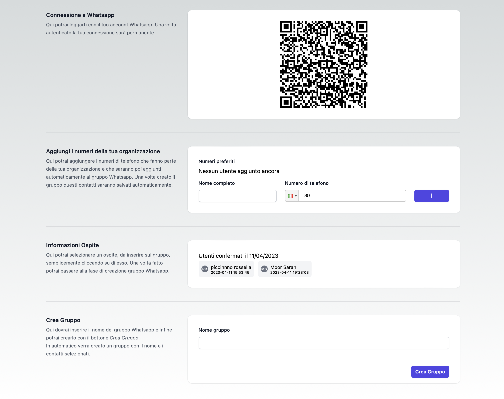

# WhatsApp Group Generate

With this project you can create a WhatsApp group in automatic way with [WhatsApp-web.js](https://docs.wwebjs.dev) taking guests from [Kross](https://www.krossbooking.com) service APIs. omunication between server and client is via socket.

## Project overview

This project is a monorepo created with [Lerna.js](https://lerna.js.org) composed of two packages: `app` and `server`. The app side is realized with React.js 18+ and the server side is a Node.js application.

## App screenshot

This is how the application shows up:



As you can see, we have some steps (not translated yet 😅) before create a WhatsApp group and every steps must be completed to be able to create a group!

## Clone project

Once the project is cloned, enter the root and run the following commands:

```bash
cd whatsapp-group-generator && npm i
```

and then execute both the application only with

```bash
npm run start
```

Enjoy 🙃
